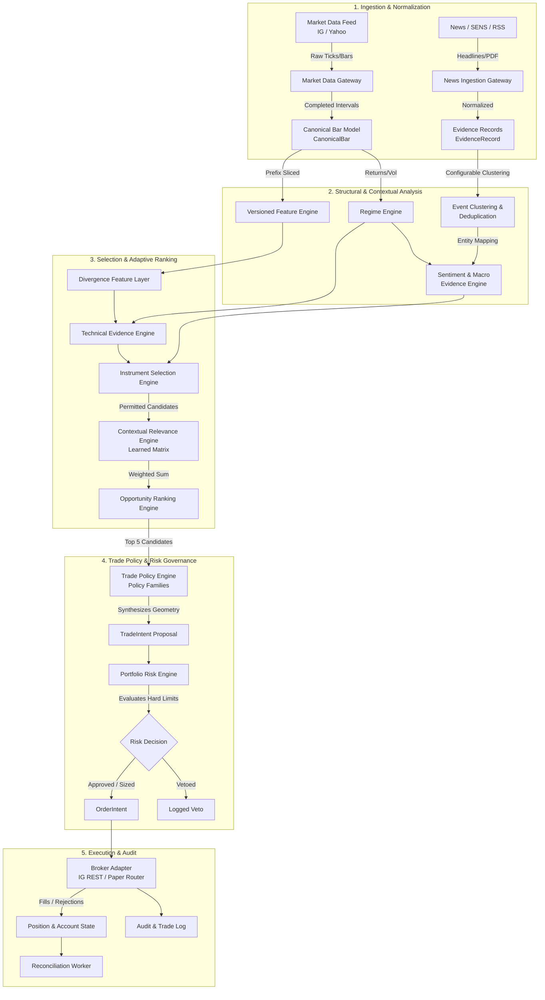

# ARCHITECTURE.md
## Canonical Trading System Architecture & Technical Specification
**Author:** Lead Systems Architect & Quantitative Software Auditor  
**Status:** Approved Corrected Design Baseline  
**Scope:** Migration & Strangler Consolidation of `trading-system-complete`  
**Target Environment:** Local Development, Cloud Container Services (Railway)  

---

### 1. Executive Summary

This architecture establishes a single, causally sound, broker-agnostic trading research and execution platform. It unifies five historically fragmented generations of software within the repository:
1. The **Legacy Baseline** (a hardcoded $60/30/10$ technical/sentiment/macro scorer inside `signal_pipeline.py`).
2. The **Multi-Agent Simulation** (`merged_simulation.py`, currently disconnected from the live app).
3. The **Daily Research Pipeline** (HR7 point-in-time features, HR8 indicator effectiveness, HR9 adaptive ensemble, and HR10 purged/embargoed robustness gates).
4. The **Intraday Multi-Instrument Layer** (HR11 causal bar timing, explicit session windows, turnover-based cost modeling, and paper routing).
5. The **Operational Intelligence Dashboard & Market Intelligence Layer** (OI2/OI3 public quote caches, RSS/SENS scraping, and OI4 SQLite source policies).

The target architecture replaces fragmented heuristic scoring, antagonistic indicator confirmation, and unverified mock handoffs with an end-to-end, four-tier decision engine:
$$\text{Human Governance} \longrightarrow \text{Learned Contextual Relevance} \longrightarrow \text{Trade Policy \& Risk Engine} \longrightarrow \text{Broker Execution}$$

The platform answers five foundational questions for the operator:
1. **What should be traded?** (Dynamic ranking of permitted instruments by liquidity, friction, regime, and setup quality).
2. **In which direction?** (Contextual fusion of non-redundant technical, macro, and event signals).
3. **How should it be entered and exited?** (Explicit, testable policy families defining order type, trigger level, time-in-force, structural/volatility stop, target, time exit, and invalidation rules).
4. **How much capital and risk should be allocated?** (Continuous user aggression preferences evaluated against configurable hard portfolio risk constraints).
5. **Why does the system believe this, and what is its out-of-sample track record?** (Full explainability down to raw sources, clustered events, and walk-forward empirical distributions).

---

### 2. Verified Starting Architecture

The audit and cross-examination established the following ground-truth operational constraints:
* **The Dashboard Pathway:** The live decision card in `app.py` is driven by `operational_intelligence.py:analyze()`, querying `asset_technical_features.csv` (HR7 daily history) and `legacy_technical_score()` (`signal_pipeline.py`). It calculates:
  $$\text{Score} = 0.60 \cdot \text{Technical} + 0.30 \cdot \text{Sentiment} + M$$
  with fixed thresholds at $> +0.35$ (BUY) and $< -0.35$ (SELL).
* **The Legacy Zero-Trade Anomaly:** In historical reconstructions where contemporaneous news sentiment and macro series were unpersisted ($S=0, M=0$), the technical score $T \in [-0.50, +0.50]$ yielded a maximum combined score of $\pm 0.30$. Because $\pm 0.30$ cannot breach the $\pm 0.35$ threshold, the legacy strategy generated **0 trades across 4,326 historical opportunities**. In live operations, trade generation is enabled solely when news sentiment provides the missing $\pm 0.06$ to $\pm 0.25$ boost.
* **Dead / Disconnected Layers:** `merged_simulation.py` (multi-agent quorum) is completely disconnected from `app.py`. `generate_app.py` is broken due to importing deleted `INDEX_HTML`. `opportunity_scanner.py` runs a separate, advisory 70/30 momentum/news scan on 18 Yahoo tickers that does not feed the trading engine.
* **Empirical Research Findings:** HR9's daily adaptive ensemble failed out-of-sample testing at 10 bps turnover cost, causing HR10 to reject all 40 instrument-horizon cells. Conversely, HR11's 180 unadmitted cells represent an unexercised data pipeline due to unsupplied 5-minute historical datasets, rather than empirical failure. Both remain immutable scientific baselines.
* **Persistence & Transport State:** Critical learned state in memory is wiped on container restart. Local headed Playwright automation (`ost_browser.py`) is unsuitable for headless cloud containers.

---

### 3. System Goals

1. **Single Authoritative Data & Signal Pipeline:** Consolidate disparate indicator calculations into a versioned, registry-backed feature engine.
2. **Contextual Learned Relevance:** Transition from rigid $60/30/10$ or $70/30$ heuristics to an empirical matrix of:
   $$\text{Instrument} \times \text{Regime} \times \text{Feature} \times \text{Horizon}$$
3. **Hypothesis-Driven Strategy Evolution:** Enforce a strict experimental lifecycle where every modification to an indicator, entry policy, or stop definition is tested out-of-sample against an explicit `StrategyTarget` before baseline promotion.
4. **Top-5 Opportunity User Experience:** Transition the GUI from a raw indicator grid to a decision cockpit presenting the Top 5 ranked opportunities with complete trade geometry and live risk sliders.
5. **Lean Headless Cloud Architecture:** Structure the application for multi-process container deployment on Railway with a Web Service, Worker Service, and persistent PostgreSQL storage.
6. **Broker Neutrality with IG Integration:** Implement a formal `BrokerAdapter` protocol with IG REST/Streaming as the primary execution and execution-grade historical data provider, while maintaining clean abstraction for Standard Bank/Shyft and MT5.

---

### 4. Non-Goals

1. **No Autonomous Rule Modification:** The AI/agent layer may never alter hard portfolio risk constraints, margin limits, or loss ceilings.
2. **No Unsolicited API / SDK Integrations:** External APIs are integrated only when explicitly governed by the user.
3. **No Retrospective Parameter Optimization:** Historical parameters must never be tweaked to maximize retrospective Sharpe or win rate.
4. **No Headed Browser Scraping in Cloud Deployments:** `ost_browser.py` remains isolated local legacy tooling; it will not be deployed to Railway.
5. **No Forced Framework Rewrites:** Flask is preserved as the web application container until measured requirements necessitate an ASGI/FastAPI migration.
6. **No Premature Cloud Infrastructure:** Redis, Celery, and TimescaleDB will not be introduced until measured workload, concurrency, or time-series scale strictly demand them.

---

### 5. Scientific Invariants

The platform strictly enforces the following thirteen scientific invariants:
1. **Zero Look-Ahead Information:** $\text{available\_time} \le \text{decision\_time}$ for every feature, regime, and weight.
2. **Causal Historical Evaluation:** Observations are strictly sliced up to decision index $t$. Completed-interval event clocks ($T_{\text{end}}$) denote bar availability.
3. **Strict Separation of Evaluator and Decision Clock:** Future outcomes evaluate an earlier decision but never influence it.
4. **Explicit Horizon Typing:** Daily session horizons ($H \in \{1, 3, 5, 20\}$ days) and intraday duration horizons ($H \in \{5\text{m}, 15\text{m}, 30\text{m}, 60\text{m}, \text{EOD}\}$) are distinct, collision-free types.
5. **Non-Overlapping Trade Execution:** Multi-horizon evaluations must enforce non-overlapping holding periods or explicitly model stateful portfolio turnover to avoid degrees-of-freedom inflation.
6. **Turnover-Based Transaction Costs:** Costs are charged on originating signal-state turnover:
   $$\text{Turnover} = |S_t - S_{t-1}|$$
   Holds incur zero commission/spread; reversals incur two sides of turnover.
7. **Prequential Learning Boundaries:** Online adaptation uses only matured outcomes whose forward evaluation horizon has completely elapsed prior to the decision point:
   $$\text{label\_end} + \text{purge} < \text{decision\_time} \quad \text{and} \quad \text{outcome\_available} + \text{embargo} < \text{decision\_time}$$
8. **No Metric-Hacking Refactoring:** Strategy logic cannot be altered merely to improve historical profitability or hit rate.
9. **Explicit Semantics for Missing Data:** Unavailable inputs emit explicit `None` / `UNAVAILABLE` states. Missing data is never coerced to neutral zero.
10. **Decoupled Dashboard Logic:** The GUI must never recalculate, filter, or alter trading logic independently of the backend domain model.
11. **Deterministic Separation of LLM Output:** Unstructured LLM text interpretations are stored separately with distinct provenance from deterministic mathematical signals.
12. **Mandatory Sample Counts:** Every statistical metric, hit rate, and performance claim must report its sample count $N$ and confidence interval.
13. **Immutability of Historical Research:** Validated baseline artifacts (`asset_technical_features.csv`, `adaptive_technical_decisions_v2.csv`, `report.json`) remain byte-for-byte immutable under SHA-256 validation.

---

### 6. Authority & Governance Model

The platform enforces a strict four-tier separation of authority:

```
┌────────────────────────────────────────────────────────┐
│               TIER 1: HUMAN GOVERNANCE                 │
│  • Whitelists permitted instruments, sources, & feeds  │
│  • Configures hard risk limits (loss caps, margin cap) │
│  • Selects operational mode (Advisory / Demo / Auto)   │
└───────────────────────────┬────────────────────────────┘
                            │ Sets Permitted Envelope
                            ▼
┌────────────────────────────────────────────────────────┐
│            TIER 2: LEARNED RELEVANCE MATRIX            │
│  • Evaluates empirical out-of-sample factor edge       │
│  • Adjusts weights by Instrument x Regime x Horizon    │
│  • Shrinks weights to neutral (1.0) when N < 30        │
└───────────────────────────┬────────────────────────────┘
                            │ Weights Input Conviction
                            ▼
┌────────────────────────────────────────────────────────┐
│         TIER 3: TRADE POLICY & PROPOSAL ENGINE         │
│  • Ranks Top Opportunities across permitted universe   │
│  • Synthesizes Technical, Macro, & Event Evidence      │
│  • Formulates candidate TradeIntent using Policy Family│
└───────────────────────────┬────────────────────────────┘
                            │ Proposes Execution
                            ▼
┌────────────────────────────────────────────────────────┐
│            TIER 4: RISK ENGINE (FINAL VETO)            │
│  • Evaluates TradeIntent against portfolio state       │
│  • Checks: Daily Loss, Concentration, Leverage Cap     │
│  • Verdict: APPROVED, REDUCED SIZE, or VETOED          │
└────────────────────────────────────────────────────────┘
```

---

### 7. Canonical Runtime Architecture

The target runtime separates user-facing web operations from continuous asynchronous workers, coordinated via a shared database:

```
                             ┌───────────────────────────────────┐
                             │       WEB BROWSER CLIENT          │
                             │  • Top-5 Opportunity Cockpit      │
                             │  • Explainability & Traceability  │
                             │  • Aggression & Source Toggles    │
                             └─────────────────┬─────────────────┘
                                               │
                                               ▼ HTTP REST / WebSocket (Port 5000 / 3000)
┌────────────────────────────────────────────────────────────────────────────────────────┐
│                                 WEB SERVICE DYNO                                       │
│  ┌──────────────────────────────────────────────────────────────────────────────────┐  │
│  │ Web / API Service Boundary (Flask / ASGI-ready)                                  │  │
│  │   ├── /api/v2/opportunities        (Top-5 suggestions + trade geometry)          │  │
│  │   ├── /api/v2/sources              (Source Registry CRUD + manual toggle)        │  │
│  │   ├── /api/v2/indicators           (Indicator Registry CRUD + parameter status)  │  │
│  │   ├── /api/v2/portfolio            (Live balances, positions, margin, exposure)  │  │
│  │   ├── /api/v2/risk/preview         (Slider aggression exposure simulation)       │  │
│  │   ├── /api/v2/trade/intent         (Assisted / Manual execution dispatch)        │  │
│  │   └── /api/v2/research/experiments (Experiment logs, targets, baseline diffs)   │  │
│  └───────────────────────────────────────────┬──────────────────────────────────────┘  │
└──────────────────────────────────────────────┼─────────────────────────────────────────┘
                                               │
                                               ▼
┌────────────────────────────────────────────────────────────────────────────────────────┐
│                            PERSISTENCE & SHARED BUS                                    │
│  ┌──────────────────────────────────────────────────────────────────────────────────┐  │
│  │ PostgreSQL 16 (Relational & Timeseries Storage)                                  │  │
│  │  • Timeseries Tables: Bars, Quotes, Spreads                                      │  │
│  │  • Relational Tables: Registries, Source Policies, TradeIntents                  │  │
│  │  • Analytics Tables: Execution Logs, Experiment Registry                         │  │
│  └───────────────────────────────────────────▲──────────────────────────────────────┘  │
└──────────────────────────────────────────────┼─────────────────────────────────────────┘
                                               │
                                               ▼ Read/Write
┌────────────────────────────────────────────────────────────────────────────────────────┐
│                               WORKER SERVICE DYNO                                      │
│  ┌──────────────────────────────────────────────────────────────────────────────────┐  │
│  │ Background Schedulers & Continuous Engines                                       │  │
│  │   ├── Market Data Gateway (IG Streaming / REST / Yahoo backup)                   │  │
│  │   ├── Ingestion Gateway (Moneyweb RSS, SENS, NewsAPI, PDF parser)                │  │
│  │   ├── Event Clustering & Deduplication Engine                                    │  │
│  │   ├── Canonical Feature Engine (Versioned Indicators)                            │  │
│  │   ├── Regime Engine (Trend, Volatility, Macro Risk state)                        │  │
│  │   ├── Instrument Selection & Opportunity Ranking Engine                          │  │
│  │   ├── Trade Policy Engine (Geometry synthesis from Candidate Policy)             │  │
│  │   ├── Portfolio Risk Engine (Hard constraint evaluation)                         │  │
│  │   ├── Broker Execution Gateway (IG REST / Paper Engine)                          │  │
│  │   └── Causal Evaluator & Performance Attribution Worker                          │  │
│  └──────────────────────────────────────────────────────────────────────────────────┘  │
└────────────────────────────────────────────────────────────────────────────────────────┘
```

---

### 8. Domain Boundaries & Module Responsibilities

The codebase is organized into four clean domain layers:

```
├── domain/
│   ├── contracts/             # Immutable data definitions (Bar, Quote, TradeIntent, EvidenceRecord)
│   ├── registry/              # Central Registries (Instrument, Source, Indicator/Feature)
│   ├── market_data/           # Market data ingestion, session calendars, and historical gateways
│   ├── intelligence/          # Event clustering, mention extraction, and LLM providers
│   ├── features/              # Authoritative technical, regime, and divergence calculations
│   ├── strategy/              # Instrument selection, contextual relevance, and opportunity ranking
│   ├── policy/                # Trade policy families, trade geometry, and invalidation synthesis
│   ├── risk/                  # Portfolio exposure engine, margin calculator, and risk constitution
│   ├── broker/                # BrokerAdapter protocol, IG implementation, and Paper broker
│   └── evaluation/            # Walk-forward evaluator, purged folds, robustness, and experiments
├── persistence/               # Database repositories, migrations, and PostgreSQL models
├── api/                       # Web REST routes, WebSocket handlers, and payload validation
├── workers/                   # Scheduled tasks, streaming loops, and background jobs
└── ui/                        # Browser application assets, templates, and static files
```

---

### 9. Data-Flow Architecture



---

### 10. Module Responsibilities & Preservation Matrix

| Future Canonical Module | Subsumed / Migrated Legacy Modules | Architectural Role | Preservation Action |
|---|---|---|---|
| `domain.contracts` | `intraday_data.py`, `provider_interfaces.py`, `evidence.py` | Universal dataclasses (`CanonicalBar`, `TradeIntent`, `EvidenceRecord`) | **Preserve & Unify**: Retain HR11 timing semantics; merge `TradeSuggestion` with `TradeIntent`. |
| `domain.registry.instrument` | `instrument_registry.py`, `intraday_instruments.py` | Multi-asset instrument definitions, contract metadata, and broker symbol mappings | **Preserve & Expand**: Standardize on `intraday_instruments.InstrumentDefinition`; maintain legacy aliases. |
| `domain.registry.source` | `source_catalog.py`, `market_intelligence/source_registry.py` | Registry of news, SENS, and macro providers with authority tiers and toggle states | **Preserve**: Keep OI4 SQLite-backed `SourceRegistry` and migrations as foundation; map to PostgreSQL. |
| `domain.registry.feature` | `technical_feature_registry.py`, `technical_signals.py` | Versioned catalog of mathematical indicator definitions and parameters | **Version & Preserve**: Prevent silent overwrites; register legacy formulas as explicit `_legacy_v1`. |
| `domain.features.technical` | `research_indicators.py`, `intraday_features.py`, `asset_specific_technicals.py` | Causal indicator calculations (RSI, Ichimoku, Bollinger, ATR, VWAP, Swings) | **Consolidate & Version**: Migrate calculations behind the versioned feature registry interface. |
| `domain.features.regime` | `regime_engine.py`, `intraday_signals.py:regimes` | Multi-label trend, volatility, and macro risk classification | **Version & Unify**: Expose explicit `MarketRegime` vector; preserve legacy regime formulas under v1 tag. |
| `domain.features.divergence` | *New implementation* | Detects price vs. momentum and technical vs. sentiment divergence as explicit candidate features | **Implement New**: Introduce divergence as an evaluable alpha feature. |
| `domain.strategy.selection` | `opportunity_scanner.py` (advisory) | Ranks the permitted universe by spread, liquidity, regime, and setup quality | **Replace & Upgrade**: Transition from disconnected UI scanner to strategy-level selection engine. |
| `domain.strategy.relevance` | `adaptive_fusion.py`, `indicator_effectiveness.py` | Contextual weighting matrix ($I \times R \times F \times H$) with empirical shrinkage | **Refactor**: Rebuild online accumulator to load and persist weights in PostgreSQL. |
| `domain.policy.engine` | `operational_intelligence.py:155` | Formulates trade geometry from candidate policy families (entry method, stop, target) | **Implement New**: Replace raw score multiplier with configurable `TradePolicyEngine`. |
| `domain.risk.engine` | `merged_simulation.py:RiskAgent` | Enforces configurable hard portfolio risk limits, margin caps, and exposure scaling | **Refactor**: Decouple risk checks from multi-agent quorum; enforce account-level math without hardcoded limits. |
| `domain.broker.adapter` | `viewpoint_adapter.py`, `ost_browser.py`, `intraday_router.py` | Broker-neutral protocol for market data, account balances, and order lifecycle | **Implement New**: Build `BrokerAdapter` protocol; implement IG REST/Streaming and Paper broker. |
| `domain.evaluation.causal` | `intraday_evaluation.py`, `hr10_robustness.py`, `evaluation.py` | Purged/embargoed walk-forward backtesting, block bootstrap, and FDR admission | **Preserve**: Standardize on HR11/HR10 non-overlapping execution evaluator. |

---

### 11. Canonical Data Contracts

Every domain object is immutable (`frozen=True`) and carries explicit provenance:

```python
from dataclasses import dataclass
from datetime import datetime
from enum import Enum
from typing import Optional, Tuple, Dict, Any

class DataGrade(str, Enum):
    RESEARCH = "RESEARCH_DATA"
    DELAYED_PUBLIC = "DELAYED_PUBLIC"
    EXECUTION_GRADE = "EXECUTION_GRADE"

class Direction(str, Enum):
    LONG = "LONG"
    SHORT = "SHORT"
    FLAT = "FLAT"

class EntryPolicyType(str, Enum):
    MARKET = "MARKET"
    PULLBACK_LIMIT = "PULLBACK_LIMIT"
    BREAKOUT_STOP = "BREAKOUT_STOP"
    CONFIRMATION_ENTRY = "CONFIRMATION_ENTRY"
    SCALE_IN = "SCALE_IN"

class StopPolicyType(str, Enum):
    STRUCTURAL_INVALIDATION = "STRUCTURAL_INVALIDATION"
    ATR_VOLATILITY = "ATR_VOLATILITY"
    FIXED_DISTANCE = "FIXED_DISTANCE"
    SWING_LEVEL = "SWING_LEVEL"
    TIME_STOP = "TIME_STOP"

class ExitPolicyType(str, Enum):
    FIXED_TARGET = "FIXED_TARGET"
    RISK_REWARD_TARGET = "RISK_REWARD_TARGET"
    TRAILING = "TRAILING"
    TIME_EXPIRY = "TIME_EXPIRY"
    SIGNAL_REVERSAL = "SIGNAL_REVERSAL"
    REGIME_CHANGE = "REGIME_CHANGE"

@dataclass(frozen=True)
class SourcePolicy:
    source_id: str
    authority_tier: int               # 1=Authoritative, 2=Market, 3=Media, 4=Community
    access_mode: str                  # licensed, public_rss, manual
    data_grade: DataGrade
    max_age_seconds: int
    status: str                       # PRODUCTION, SHADOW, RESEARCH, BLOCKED

@dataclass(frozen=True)
class CanonicalBar:
    instrument_id: str
    timeframe: str                   # 5m, 15m, 30m, 60m, 1d
    interval_start: datetime          # UTC bar open
    event_time: datetime              # UTC bar close (completed interval)
    available_time: datetime          # UTC earliest availability clock
    open: float
    high: float
    low: float
    close: float
    volume: Optional[float]
    bid: Optional[float]
    ask: Optional[float]
    source_policy: SourcePolicy
    input_record_ids: Tuple[str, ...]

@dataclass(frozen=True)
class ClusteredEvent:
    event_id: str
    cluster_fingerprint: str
    first_observed_at: datetime
    latest_observed_at: datetime
    primary_headline: str
    entity_tickers: Tuple[str, ...]
    macro_assets: Tuple[str, ...]
    consensus_direction: int          # -1, 0, +1
    aggregate_strength: float         # 0.0 - 1.0
    underlying_evidence_ids: Tuple[str, ...]
    is_duplicate_cluster: bool

@dataclass(frozen=True)
class CandidateTradePolicy:
    policy_id: str
    policy_version: str
    entry_policy: EntryPolicyType
    stop_policy: StopPolicyType
    exit_policy: ExitPolicyType
    parameters: Dict[str, Any]

@dataclass(frozen=True)
class TradeGeometry:
    policy_snapshot: CandidateTradePolicy
    entry_price: float
    invalidation_price: float         # Structural thesis invalidation level
    stop_loss_price: float
    take_profit_price: float
    expected_holding_seconds: int
    trailing_stop_activation: Optional[float]
    trailing_stop_distance: Optional[float]
    time_exit_cutoff: datetime

@dataclass(frozen=True)
class TradeIntent:
    intent_id: str
    strategy_version: str
    instrument_id: str
    execution_symbol: str
    generated_at: datetime
    direction: Direction
    opportunity_score: float          # Bounded in [-1.0, 1.0]
    opportunity_rank: int             # 1 through 5
    regime_snapshot: Dict[str, Any]
    geometry: TradeGeometry
    requested_units: float
    requested_notional: float
    estimated_cost: float
    contributing_feature_ids: Tuple[str, ...]
    evidence_provenance_ids: Tuple[str, ...]
    expires_at: datetime

@dataclass(frozen=True)
class RiskDecision:
    intent_id: str
    evaluated_at: datetime
    approved: bool
    reduced_size: bool
    authorized_units: float
    authorized_notional: float
    maximum_loss_monetary: float
    committed_margin: float
    remaining_portfolio_risk_budget: float
    hard_limit_checks: Dict[str, bool]
    rejection_reasons: Tuple[str, ...]

@dataclass(frozen=True)
class OrderIntent:
    order_intent_id: str
    intent_id: str
    instrument_id: str
    broker_symbol: str
    side: str                         # BUY, SELL
    order_type: str                   # MARKET, LIMIT, STOP
    price: float
    quantity: float
    time_in_force: str                # GTC, IOC, DAY
    client_order_id: str
    mode: str                         # PAPER, DEMO, LIVE
    dispatched_at: datetime
```

---

### 12. Timestamp & Causality Semantics

Every record obeys strict causal sequencing:
$$T_{\text{interval\_start}} < T_{\text{event\_time}} \le T_{\text{available\_time}} \le T_{\text{decision\_time}}$$

1. **Bar Interval Close ($T_{\text{event\_time}}$):** The exact microsecond the bar interval concludes. A 5-minute bar from 09:00:00 to 09:05:00 has $T_{\text{event\_time}} = \text{09:05:00 UTC}$.
2. **Dissemination Availability ($T_{\text{available\_time}}$):** The earliest time the system could access the completed observation. For streaming feeds:
   $$T_{\text{available\_time}} = T_{\text{event\_time}} + \Delta_{\text{network}}$$
   For daily Yahoo historical bars:
   $$T_{\text{available\_time}} = \text{Date} + 1 \text{ day at 00:00:00 UTC}$$
3. **Decision Execution ($T_{\text{decision\_time}}$):** The timestamp of signal generation. Only records with $T_{\text{available\_time}} \le T_{\text{decision\_time}}$ may enter calculations.
4. **Execution Fill:** A trade triggered at $T_{\text{decision\_time}}$ is entered at the **open price of the subsequent bar** ($T_{\text{decision\_time}} + \Delta_{\text{tick}}$). Instantaneous fills at $T_{\text{decision\_time}} close are prohibited.

---

### 13. Canonical Instrument Registry

Reconciling `instrument_registry.py` and `intraday_instruments.py`, the canonical registry defines every tradable and proxy asset:

```
┌─────────────────────────┬────────────────────────────┬─────────────────────────────┐
│ Category                │ Canonical Instrument ID    │ Underlying / Target Mapping │
├─────────────────────────┼────────────────────────────┼─────────────────────────────┤
│ Cash Equity             │ EQ_ZAR_SASOL               │ SASOL (JSE: SOL)            │
│ Cash Equity             │ EQ_ZAR_NASPERS             │ NPN (JSE: NPN)              │
│ Cash Equity             │ EQ_ZAR_BHP                 │ BHP (JSE: BHG)              │
│ Cash Equity             │ EQ_ZAR_ABSA                │ ABSA (JSE: ABG)             │
│ Cash Equity             │ EQ_ZAR_IMPLATS             │ IMPLATS (JSE: IMP)          │
│ Cash Equity             │ EQ_ZAR_SHOPRITE            │ SHOPRITE (JSE: SHP)         │
│ Index Derivative / CFD  │ CFD_ZAR_ALSI40             │ JSE Top 40 (Proxy: ^J203)   │
│ FX CFD / Spot Proxy     │ FX_ZAR_USDZAR              │ USD/ZAR Spot (USDZAR)       │
│ Commodity CFD / Proxy   │ COMM_USD_BRENT             │ Brent Crude (BZ=F)          │
│ Commodity CFD / Proxy   │ COMM_USD_GOLD              │ Gold Spot/Future (GC=F)     │
│ Commodity CFD / Proxy   │ COMM_USD_PLATINUM          │ Platinum Spot (PL=F)        │
└─────────────────────────┴────────────────────────────┴─────────────────────────────┘
```

#### Instrument Governance States:
* `MANDATORY`: Always evaluated and tracked; cannot be disabled by user.
* `PRODUCTION`: Permitted for live/demo trade execution.
* `SHADOW`: Generates trade intents in paper mode; excluded from broker routing.
* `RESEARCH`: Evaluated in offline backtests only.
* `DISABLED`: Inactive in all evaluation pipelines.
* `BLOCKED`: Hard safety veto; system refuses data ingest and order execution.

---

### 14. Extended Source Registry

The canonical Source Registry builds on `market_intelligence/store.py`, adding rate-limiting and learned effectiveness metadata:

```
┌────────────────────────────────────────────────────────────────────────────────┐
│                       EXTENDED SOURCE REGISTRY MODEL                           │
├────────────────────────────────────────────────────────────────────────────────┤
│ source_id: str (PK)                    │ enabled: bool                         │
│ source_name: str                       │ governance_state: str (MANDATORY/PROD)│
│ source_class: str (authoritative_event,│ authority_tier: int (1, 2, 3, 4)      │
│                    financial_media,    │ url_endpoint: str                     │
│                    market_data,        │ access_mode: str (rss, api, scrape)   │
│                    community)          │ minimum_poll_interval_seconds: int    │
│ manual_weight_multiplier: float        │ rate_limit_rpm: int                   │
│ learned_reliability_score: float       │ last_successful_fetch: datetime       │
│ timeliness_score: float (latency ms)   │ consecutive_failure_count: int        │
│ primary_coverage_sectors: tuple[str]   │ source_health_status: str             │
└────────────────────────────────────────────────────────────────────────────────┘
```

---

### 15. Versioned Indicator & Feature Registry

To preserve historical reproducibility while eliminating drift, indicators are versioned explicitly. Legacy calculations remain frozen:

```
┌──────────────────────────────────────┬────────────┬────────────────────────────────────────────────────────┐
│ Feature ID & Version                 │ Category   │ Mathematical Formulation                               │
├──────────────────────────────────────┼────────────┼────────────────────────────────────────────────────────┤
│ `feat_rsi_wilder_v2`                 │ Momentum   │ True Wilder smoothed 14-period RSI using exponential   │
│                                      │            │ moving average of gains/losses.                        │
├──────────────────────────────────────┼────────────┼────────────────────────────────────────────────────────┤
│ `feat_rsi_legacy_v1`                 │ Momentum   │ Legacy simple moving average RSI on closes only        │
│                                      │            │ (Preserved for backward baseline tests).               │
├──────────────────────────────────────┼────────────┼────────────────────────────────────────────────────────┤
│ `feat_stoch_ohlc_v2`                 │ Momentum   │ True Fast %K = (C - L14)/(H14 - L14); True %D = SMA3   │
│                                      │            │ using true bar Highs and Lows.                         │
├──────────────────────────────────────┼────────────┼────────────────────────────────────────────────────────┤
│ `feat_stoch_close_legacy_v1`         │ Momentum   │ Legacy close-only stochastic (Preserved for tests).    │
├──────────────────────────────────────┼────────────┼────────────────────────────────────────────────────────┤
│ `feat_donchian_break_v2`             │ Structure  │ True High/Low Donchian channel breach over prior 20.   │
├──────────────────────────────────────┼────────────┼────────────────────────────────────────────────────────┤
│ `feat_breakout_close_legacy_v1`      │ Structure  │ Legacy close-to-close-extrema breakout.                │
├──────────────────────────────────────┼────────────┼────────────────────────────────────────────────────────┤
│ `feat_macd_line_signal_v2`           │ Trend      │ MACD Line (12, 26) + Signal Line (9) + Histogram.      │
├──────────────────────────────────────┼────────────┼────────────────────────────────────────────────────────┤
│ `feat_macd_diff_only_legacy_v1`      │ Trend      │ Legacy EMA12 - EMA26 difference only.                  │
├──────────────────────────────────────┼────────────┼────────────────────────────────────────────────────────┤
│ `feat_ichimoku_full_v1`              │ Cloud      │ Displaced Tenkan/Kijun/Cloud model (HR5/HR7 baseline). │
├──────────────────────────────────────┼────────────┼────────────────────────────────────────────────────────┤
│ `feat_session_vwap_v1`               │ Intraday   │ Volume-weighted price anchored to session open.        │
└──────────────────────────────────────┴────────────┴────────────────────────────────────────────────────────┘
```

---

### 16. Event Deduplication & Configurable Clustering Model

To prevent syndicated news stories from acting as multiple independent votes, the system implements a two-tier deduplication model:

1. **Tier 1 (Exact Content Hash):** SHA-256 hash of normalized headline and URL (`evidence.py`).
2. **Tier 2 (Configurable Semantic Event Clustering):**
   * Groups incoming stories within a **configurable rolling event window** ($\Delta_{\text{cluster}}$).
   * Clusters on common JSE ticker entities + commodity tags + configurable textual similarity threshold ($\theta_{\text{sim}}$).
   * Multiple wire reports (e.g., Reuters article reprinted by Moneyweb and News24) form a single `ClusteredEvent`.
   * **Voting Rule:** The event votes **once** in the sentiment engine. Its authority score scales with publisher tier ($\max(\text{Tier})$), while repeated coverage boosts event confirmation confidence rather than directional weight.
   * **Invariant:** Both $\Delta_{\text{cluster}}$ and $\theta_{\text{sim}}$ are experimental parameters managed through the Experiment Engine, not immutable constants.

---

### 17. Divergence & Disagreement Feature Layer

Divergence is modeled as an explicit, evaluable candidate feature family:

1. **Price vs. Oscillator Divergence (`feat_div_price_rsi`):**
   * *Bullish Divergence:* Price makes a lower low over trailing $N$ bars while RSI makes a higher low.
   * *Bearish Divergence:* Price makes a higher high while RSI makes a lower high.
2. **Technical vs. News Divergence (`feat_div_tech_sentiment`):**
   * Triggered when $\text{sign}(\text{Technical Score}) \neq \text{sign}(\text{Sentiment Score})$ and both absolute values exceed configured significance thresholds.
   * Evaluates whether technical price action or fundamental news shocks lead in specific market regimes.
3. **Cross-Asset Lead/Lag Divergence (`feat_div_cross_asset`):**
   * Disagreement between a stock and its macro driver (e.g. Brent crude up while Sasol is down).
   * Modeled as a testable hypothesis within the Experiment Registry.

---

### 18. Regime Engine

The Regime Engine unifies disjoint heuristics into a single typed `MarketRegime` vector evaluated on completed bars:

```python
@dataclass(frozen=True)
class MarketRegime:
    evaluated_at: datetime
    trend_state: str                  # STRONG_BULL, WEAK_BULL, RANGE, WEAK_BEAR, STRONG_BEAR
    volatility_state: str             # LOW_COMPRESSION, NORMAL, HIGH_EXPANSION, EXTREME_SHOCK
    macro_risk_state: str             # RISK_ON, NEUTRAL, RISK_OFF
    liquidity_regime: str             # HIGH_LIQUIDITY, NORMAL, THIN_SPREAD_WIDENING
    trend_metric_value: float
    realized_volatility_value: float
    volatility_percentile: float
    spread_ratio: float
```

* Thresholds separating states (e.g. ADX levels, return slopes, volatility cutoffs) are versioned parameters stored in configuration, allowing empirical calibration across different asset classes.

---

### 19. Contextual Effectiveness & Learning Matrix

Learned reliability weights are stored in PostgreSQL under the matrix schema:
$$\mathbf{Effectiveness}(I, R, F, H)$$
* $I$: Instrument ID
* $R$: Market Regime
* $F$: Feature ID
* $H$: Target Horizon

#### Online Adaptation Formula:
For a sequence of matured, non-overlapping outcomes $N$:
1. If $N < 30$, $\mathbf{Weight = 1.0}$ (Neutral prior).
2. If $N \ge 30$:
   $$\text{Hit Rate} = \frac{\sum \mathbb{I}(S_t \cdot R_{t+H} > 0)}{N}$$
   $$\text{Shrunk Hit Rate} = \frac{\text{Wins} + 20 \cdot (0.5)}{N + 20}$$
   $$\text{Recency Component} = \sum_{j=1}^N R_j^{\text{net}} \cdot 0.5^{(N-j)/252}$$
   $$\text{Weight} = \text{clip}\left(1.0 + \text{Stability} \cdot \left[2(\text{Shrunk} - 0.5) + \frac{\text{Recency}}{0.02}\right], \mathbf{0.5}, \mathbf{1.5}\right)$$
   Where $\text{Stability} = 1.0$ if temporal halves share net return sign, else $0.5$ or $0.0$.

---

### 20. Instrument Selection & Opportunity Ranking Engine

The selection engine replaces the advisory scanner with an integrated pipeline:

1. **Hard Tradability Filtering:** Validates that the market is open, spread is within configured bounds, volume is sufficient, and data grade meets requirements.
2. **Setup Conviction Scoring:** Integrates technical signals, clustered news, and divergence features using weights from the Effectiveness Matrix.
3. **Portfolio Correlation Adjustment:** Penalizes candidates that duplicate risks of existing open positions.
4. **Top 5 Ranking:** Emits the Top 5 opportunities to the user cockpit.

---

### 21. Trade Policy Engine (Policy Families)

The Trade Policy Engine synthesizes trade geometry using explicit, testable **Policy Families** rather than fixed constants:

* **Entry Policy Family (`EntryPolicy`):**
  * `MARKET`: Execute at current market price.
  * `PULLBACK_LIMIT`: Resting limit order at support, VWAP, or moving average.
  * `BREAKOUT_STOP`: Resting stop-entry order above resistance or Donchian high.
  * `CONFIRMATION_ENTRY`: Enter only after subsequent bar confirms direction.
  * `SCALE_IN`: Staged multiple entries.
* **Stop Policy Family (`StopPolicy`):**
  * `STRUCTURAL_INVALIDATION`: Stop placed at technical thesis invalidation level.
  * `ATR_VOLATILITY`: Volatility multiple stop (parameters defined per candidate policy).
  * `SWING_LEVEL`: Stop placed beyond recent confirmed swing high/low.
  * `TIME_STOP`: Position closed if trade does not move within specified duration.
* **Exit Policy Family (`ExitPolicy`):**
  * `FIXED_TARGET`: Specified price objective.
  * `RISK_REWARD_TARGET`: Target set as multiple of initial monetary risk.
  * `TRAILING`: Trailing stop activated after threshold gain.
  * `SIGNAL_REVERSAL`: Exit immediately upon opposing model signal.
  * `REGIME_CHANGE`: Exit upon shift in market trend or volatility regime.

Every live or demo strategy runs an explicit, versioned `CandidateTradePolicy`. No policy becomes production without passing out-of-sample target criteria.

---

### 22. Risk & Portfolio Engine (Configurable Limits)

#### A. Capital Accounting
* **Account Equity ($E$):** Authoritative cash + unrealized P&L from broker.
* **Committed Margin ($M_{\text{comm}}$):** Collateral locked by broker for open positions.
* **Available Free Cash ($C_{\text{free}} = E - M_{\text{comm}}$):** Uncommitted liquid capital.
* **Notional Market Exposure ($X_{\text{notional}} = \sum |Q_i \cdot P_i \cdot \text{Multiplier}|$):** Gross value controlled.
* **Planned Stopped Risk ($R_{\text{stop}} = |P_{\text{entry}} - P_{\text{stop}}| \cdot Q_i \cdot \text{Multiplier}$):** Monetary loss if stopped out.
* **Total Portfolio Open Risk ($R_{\text{portfolio}} = \sum R_{\text{stop}, i}$):** Cumulative open risk.

#### B. The User Aggression Preference
The user selects an aggression preference:
$$\alpha \in [0.0, 1.0]$$
The preference $\alpha$ maps into the **user-configured risk envelope** (between user-defined minimum and maximum risk percentages). It controls risk allocation within hard limits, but does **not** specify raw broker leverage.

#### C. Configurable Hard Risk Constraints
Limits are explicit, configurable fields in the system risk configuration. Values remain unset until established by the operator:
1. `max_risk_per_trade_pct`: Maximum account equity risked on a single trade.
2. `max_portfolio_open_risk_pct`: Maximum cumulative risk across all open positions.
3. `max_daily_loss_limit_monetary`: Daily loss circuit breaker pausing all entries.
4. `max_margin_utilization_pct`: Maximum percentage of equity committed to margin.
5. `max_instrument_concentration_pct`: Maximum single-instrument notional exposure.
6. `max_correlated_exposure_pct`: Maximum exposure allowed in highly correlated assets.
7. `emergency_trading_pause`: Master operator kill-switch.

---

### 23. StrategyTarget Contract

Strategy promotion requires satisfying a configurable `StrategyTarget`:

```python
@dataclass(frozen=True)
class StrategyTarget:
    target_id: str
    target_name: str
    minimum_net_expectancy_bps: Optional[float]
    minimum_annualized_sharpe: Optional[float]
    minimum_sortino_ratio: Optional[float]
    maximum_drawdown_pct: Optional[float]
    maximum_turnover_per_month: Optional[float]
    minimum_completed_trades: Optional[int]
    minimum_evaluation_duration_days: Optional[int]
    fdr_adjusted_p_value_threshold: Optional[float]
    required_temporal_folds_positive_fraction: Optional[float]
```

Thresholds are configuration records, not architectural constants.

---

### 24. Contextual Performance Metrics & Sharpe Specification

To avoid statistical distortion, Sharpe and performance metrics are computed strictly within an explicit `MetricContext`:

```python
@dataclass(frozen=True)
class MetricContext:
    sampling_basis: str              # TRADE_BY_TRADE, PERIODIC_CALENDAR
    period_duration: str             # 30m, 1d
    trading_calendar: str            # JSE, 24_7, US_EQUITY
    annualization_factor: Optional[float] # Determined by calendar and duration
    is_overlapping: bool             # Must be False for valid Sharpe
    risk_free_rate_annualized: float # Explicit rate (e.g. SARB cash rate)
    cost_deducted: bool
    financing_deducted: bool
```

1. **Canonical Annualized Sharpe:** Calculated strictly on non-overlapping returns with explicit scaling ($\sqrt{K}$).
2. **Legacy Preservation:** The HR10 formula ($\frac{\mu}{\sigma}\sqrt{N}$) is preserved and explicitly renamed to `legacy_sample_scaled_t_stat` to ensure historical reports remain reproducible without corrupting canonical Sharpe reporting.

---

### 25. Data-Grade Integrity & Fallback Policy

The system strictly enforces data grades:
1. `EXECUTION_GRADE`: Direct, licensed streaming/tick data with verified broker timestamps and spreads.
2. `RESEARCH_GRADE`: High-quality historical datasets with verified intervals.
3. `DELAYED_PUBLIC`: Free, unverified public feeds (e.g. Yahoo Finance).

#### Fallback Rules:
* Public/delayed data may populate UI charts, discovery scanners, and low-grade diagnostics.
* **Public/delayed data is STRICTLY FORBIDDEN from satisfying an execution-grade requirement.**
* If an execution-grade strategy encounters a data dropout, it must **HALT AND MARK INSUFFICIENT**. It must **never** silently substitute Yahoo Finance bars and maintain execution status.

---

### 26. Broker Adapter Abstraction & IG Gateway

Execution logic communicates exclusively via the abstract `BrokerAdapter`:

```python
class BrokerAdapter(Protocol):
    async def authenticate(self) -> bool: ...
    async def get_account_state(self) -> AccountState: ...
    async def get_positions(self) -> List[Position]: ...
    async def get_open_orders(self) -> List[Order]: ...
    async def get_contract_spec(self, broker_symbol: str) -> ContractSpec: ...
    async def subscribe_market_data(self, broker_symbols: List[str]): ...
    async def get_historical_bars(self, broker_symbol: str, timeframe: str, start: datetime, end: datetime) -> List[CanonicalBar]: ...
    async def preview_order(self, intent: OrderIntent) -> OrderPreview: ...
    async def place_order(self, intent: OrderIntent) -> ExecutionResult: ...
    async def cancel_order(self, broker_order_id: str) -> bool: ...
    async def reconcile(self) -> ReconciliationReport: ...
```

#### IG Implementation Sequencing:
1. Contract and instrument discovery mapping.
2. Historical 5-minute bar retrieval (resolving HR11 data requirements).
3. Streaming market data via Lightstreamer.
4. Demo account order placement and reconciliation.
5. Live execution only after explicit milestone authorization and selection of a pilot instrument meeting strict risk and liquidity criteria.

---

### 27. GUI & API Architecture (Top-5 Cockpit & Strangler Migration)

The GUI migration follows the Strangler pattern:
1. **Phase A (Current):** Preserve existing Flask dashboard (`app.py`, `dashboard.html`).
2. **Phase B (Parallel Coexistence):** Introduce `/api/v2/` endpoints serving canonical Top-5 opportunity cards beside legacy routes.
3. **Phase C (Cockpit Primary):** Introduce the Top-5 Cockpit as the default view, retaining the legacy 30-gate panel in a secondary diagnostics tab.
4. **Phase D (Retirement):** Retire legacy decision card only after empirical parity and user validation.

---

### 28. Cloud Deployment Topology (Railway)

The production Railway deployment uses two services and a managed database:
* **Service 1 (Web Service):** Runs the web application container (Flask/Gunicorn or ASGI on Port 3000/5000), serving REST endpoints and UI templates. Ephemeral memory only.
* **Service 2 (Worker Service):** Runs continuous background loops for data ingestion, event clustering, opportunity ranking, and broker streaming.
* **Persistent Add-on (PostgreSQL 16):** Stores all registries, source configurations, clustered events, trade intents, effectiveness matrices, and audit logs. Survives container restarts.

---

### 29. Audit Logging & Security Boundaries

* **Zero Credentials in Repository:** All keys (`IG_API_KEY`, `MOONSHOT_API_KEY`, `DATABASE_URL`) are managed via environment variables.
* **Sanitized Logs:** All tokens, cookies, and passwords in HTTP communications are masked.
* **Immutable Audit Trail:** Every operator interaction (aggression change, source toggle, manual trade dispatch, mode switch) is recorded in `audit_log` with timestamp, user ID, and before/after state.

---

### 30. Autonomous Research Agent (Hermes) Operational Boundary

1. **Advisory Role Only:** Hermes monitors model performance, tracks regime decay, and suggests experiments.
2. **No Live Execution Authority:** Hermes cannot alter risk thresholds, promote strategies, or dispatch live orders without explicit human approval.
3. **Hypothesis-Driven Submissions:** Hermes proposes strategy modifications solely by creating draft records in the Experiment Registry adhering to the one-variable/attributable hypothesis rule.
