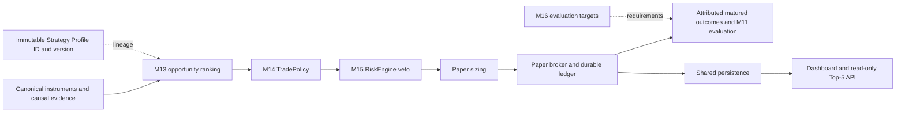
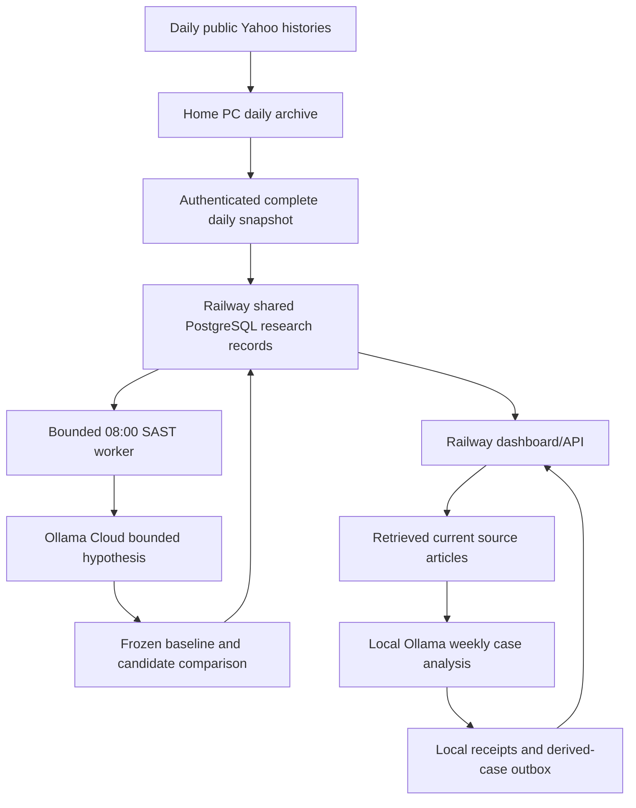

# Current architecture — 5 October 2026

Use [current state](../CURRENT_STATE.md) for the operating snapshot and [target architecture](TARGET_ARCHITECTURE.md) for work not yet implemented. Earlier accumulated milestone notes are preserved in [the checkpoint archive](../history/CURRENT_ARCHITECTURE_PRE_2026-10-05.md).

## Canonical decision path

Relevant code lives in `application/opportunities/`, `domain/evaluation/`, `domain/policy/`, `domain/risk/`, `domain/strategy/`, `domain/broker/` and `persistence/`. `app.py` composes Flask/SocketIO and API blueprints. Default Top-5 reads committed worker state when the paper loop is configured; a web refresh is not another trading cycle.

M13–M16 contracts are preserved. Registry references carry both `strategy_profile_id` and `strategy_profile_version`; selecting a card does not activate another decision engine. No broad strategy-column migration was added: compatible immutable records carry exact lineage, and old records stay unattributed. See [strategy profiles](../research/STRATEGY_PROFILES.md).

## Research lanes

Swing 1.0.1 remains canonical. Separate 1.1.0 technical shadow, 1.2.0 cash LONG daily policy replay, and 1.3.0 AI hypothesis comparisons keep independent attribution. The policy uses an observable later close, fixed structure/ATR stop and entry-based 2R target, conservative ambiguous-bar handling, 3/4/5 observed-session exits and hypothetical costs. It grants no M15 approval.

Cloud hypothesis proposals are immutable and drawn from a bounded parameter family. Training precedes the holdout, with a purge; repeated holdout use is explicitly ineligible for automatic promotion. Daily attempt reservation and stored proposals prevent retries from spending another cloud model call. These are historical experiments, not a trained LLM or validated execution strategy.

Local weekly-news analysis stores briefs, source-linked cases, receipts and delivery outboxes. Distinct publishers and duplicate controls gate the small research attention boost. Only already FLAGGED historical cases qualify for the local descriptive screen; actual receipt time determines availability. See [weekly news research](../research/WEEKLY_NEWS_RESEARCH.md).

## Physical placement

The actual uploader sends all configured histories; selective radar packets are a future design. `SWING_DATA_SOURCE=LOCAL_UPLOAD` gates the cloud paper-input path. On-demand quotes/charts and news feed reads remain separate. Windows collection at 07:30 SAST precedes Railway's `0 6 * * *` scheduled worker at 08:00 SAST; the worker exits after its work. PostgreSQL is durable, shared and does not fall back to local SQLite on failure.

Existing append-only ledger boundaries store the new research records; migrations for prior paper/shadow features remain explicit and additive. Startup never performs a production migration. Secrets remain private local/hosted configuration; dataset bodies and raw model outputs remain ignored runtime data.

## Presentation and safety

Six dashboard sections expose separate paper, strategy, canonical ranking, news, technical and system states. Printable worksheets and a manual Demo journal are available behind existing operator controls. Connected IG cash keeps account/currency provenance separate from simulator cash; journal records are self-reported.

Read-only IG authentication/discovery is working, while tested JSE history is entitlement-blocked. Alpha Vantage repair logic exists but verified JSE coverage is unresolved and scheduled calls are disabled. Estimated display bars never become trade evidence. Intraday CFD and long-term cards remain truthful placeholders. Legacy multi-agent/60–30–10 benchmark code remains preserved without reconnecting it to canonical ranking. Broker Live execution remains disabled; Demo mutations require their own existing safety gates and authorization.

The architecture's current limiting factor is admissible evidence, not proof of an AI edge: cloud replay has zero closed holdout samples and the first weekly-news scan has zero corroborated flags.

Local research addition: isolated domain/backtest core and frozen-policy bridge; no runtime wiring. See docs/research/LOCAL_BACKTEST_IMPLEMENTATION.md for scoped acceptance.

Historical SENS research extends the existing fetcher/evidence normalization with bounded ShareData/Moneyweb/Sharenet parsers and an optional event context sidecar. Actual receipt governs availability; source copies are one disclosure origin. No running collector or trade behavior is rewired. See [historic SENS pilot](../research/LOCAL_SENS_HISTORY.md) and ADR 0048.

Local implementation navigation: [operating interface](../research/LOCAL_BACKTEST_OPERATING_GUIDE.md), [B1–B5 evidence and gates](../research/LOCAL_BACKTEST_IMPLEMENTATION.md). B1–B4 are implemented in an isolated local lane; B5 real-data acceptance is blocked. The architecture's running services and safety boundaries are unchanged.

The isolated replay now supports opt-in directional OST cash-share cost sensitivity through `domain.backtest.costs.OSTCashShareCosts`, reusing the existing published component diagnostic. It includes purchase-only tax and fees during sizing, and rejects non-ZAR/non-equity manifests. This does not wire a broker or change canonical costs. Official pilot daily sessions are now verified; action, intraday volume/interval and execution evidence still block B5 acceptance. See ADR 0049 and the [continuation record](../research/LOCAL_BACKTEST_B5_CONTINUATION.md).
