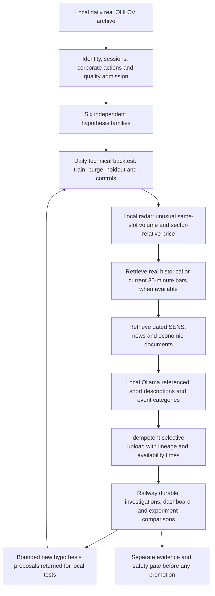

# Target architecture — local research and selective cloud memory

This document is a proposal for the next phase, not a description of implemented capabilities. Compare with [current architecture](CURRENT_ARCHITECTURE.md), [current state](../CURRENT_STATE.md), and [six swing hypotheses](../research/SIX_SWING_HYPOTHESES.md). Original target plans remain in [the dated archive](../history/TARGET_ARCHITECTURE_PRE_2026-10-05.md).

The [rule refinement 0.2](../research/SWING_RULE_REFINEMENT.md) defines bounded entry/trailing/exit comparisons, separate volume activity/evidence/risk contracts, pooled sector/share personalities and nested causal tests. South African studies motivate experiments but establish no per-sector 3–5-session indicator winner.

The owner's objective is adaptive 3–5-session strategy research: retain raw data and calculate technical evidence locally, detect unusual volume and sector-relative movement, retrieve dated news/SENS/economic context, then persist meaningful investigations and comparisons on Railway. AI proposes and categorizes; causal backtests, costs, controls and risk gates determine what survives.

The owner has now prioritised the [local backtest engine contract](../research/LOCAL_BACKTEST_ENGINE_SPEC.md) before the wider rollout. Gates B1–B5 establish deterministic replay, accounting, independent FX/gold adapters and chronological indicator selection. The [feedback loop](../research/ADAPTIVE_SWING_FEEDBACK_LOOP.md) explicitly reconsiders adding/replacing/removing indicators, with separate hypothesis tests. These are documented proposals, not installed capabilities. See [ADR 0046](../adr/0046-backtest-engine-before-adaptive-loop.md).

## Contracts to establish first

Freeze each hypothesis ID/version, dated universe membership, instrument/vehicle identity, actual price/volume basis, sector/commodity/FX benchmark, entry/exit rules and allowed modes. Keep training inputs separate from future labels, and record receipt, publication and tradable availability independently. Store denominator/control summaries for untriggered days locally so radar-selected cases do not become a biased backtest.

Equity radar draft thresholds are 1.5× the same 30-minute slot's prior-20-session volume and approximately 1.5 standardized units of sector-relative movement. They need validation; no such radar is currently enabled. FX/gold need separate verified volume contracts; spot/tick proxies cannot impersonate JSE traded shares. Never synthesize 30-minute bars from daily OHLC.

Event retrieval must precede Ollama interpretation. Record evidence as VERIFIED_BEFORE_ENTRY, POST_MOVE_EXPLANATION, PUBLISH_TIME_UNKNOWN or NO_VERIFIED_EVENT_FOUND. Later explanations cannot become earlier entry signals. Preserve source IDs, timestamps and uncertainty rather than inventing a catalyst. Weekly briefs are leads, with research-only priority, not a second confirming source.

## Placement and evolution

Extend the existing registry, causal feature/evaluation infrastructure, paper ledger, news catalog and outboxes. Start by aligning the six-family contracts and real-data admission, then implement local daily backtests, optional intraday refinement, dated event retrieval and selective upload in dependency order. Do not start all six as separate unconstrained bots.

Current daily archives/uploads and the cloud 1.3.0 comparison loop are reusable foundations. They do not yet supply the complete local engine or adaptive event taxonomy. Parameter evaluation and event memory are distinct from LLM weight fine-tuning. An always-available web/database service can retain state while bounded workers run on schedule; continuous CPU inference is not required for a 3–5-day strategy.

No automatic promotion, Live broker execution, ranking-weight changes, or legacy multi-agent reconnection belongs to this target without a separate milestone and evidence. Prospective walk-forward acceptance, sufficient independent outcomes, actual costs/liquidity and M15 veto remain required.
