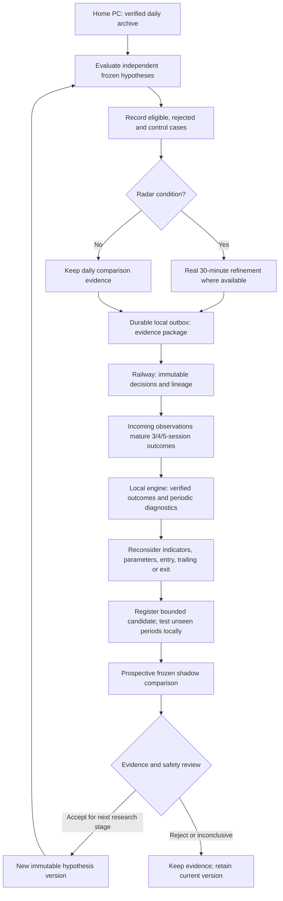

# Six-hypothesis adaptive feedback loop — proposal 0.1

5 October 2026. Documents the agreed concept, not an installed capability. The [local backtest engine contract](LOCAL_BACKTEST_ENGINE_SPEC.md) is the prerequisite; complete its B1–B5 acceptance before rewiring the dashboard or moving technical research from Railway. The [six hypotheses](SIX_SWING_HYPOTHESES.md) and [rule refinement](SWING_RULE_REFINEMENT.md) remain candidate definitions.

## Purpose and independent research lanes

Learn which entry, trailing and exit conditions produce stable 3–5-session net outcomes. Keep four equity families (selected share, resources, industrial/global exposure, banks/financials) and separate rand/dollar and gold hypotheses. Each owns indicator catalogue, benchmarks, activity inputs, costs, event categories, version and tests. Shared replay/evidence infrastructure does not imply shared technical rules or pooled trading weights.

## What is frozen before feedback

Decision identity, hypothesis/profile ID and version, engine/indicator/cost-model versions, dataset hash, instrument/product, decision/availability times, setup branch, features, quality state, entry/stop/trailing/exit specification and economic evidence known then. Include eligible denominator and no-setup/data-blocked/rejected reasons. Records are append-only; later rule changes do not rewrite old predictions.

The existing registry stage vocabulary is reused through adapters, not silently expanded: registered candidates proceed to validation/walk-forward/shadow; rejected and inconclusive experiments retain their artifacts. Acceptance for another research stage is not deployment or a live permission.

## Daily observation versus scheduled reconsideration

Daily collection adds real data, preserves revisions and matures outcomes. Local evaluation supplies traceable fill/path/accounting evidence; Railway retains compact results, unresolved states and comparison summaries. Radar can request real 30-minute observations where supported. If the PC or source is unavailable, show pending/stale coverage and retry idempotently; the cloud does not invent bars or silently switch calculations.

Periodic review is evidence-triggered, with a bounded schedule and minimum independent episode plan per family. Avoid daily strategy churn. Diagnose timing errors, false breakouts, stop-outs followed by recovery, failed recovery signals, costs and regime instability. Compare the trade path and rejected/control cases, not just winning entries. MFE/MAE ordering uncertainty remains explicit.

## Indicator reconsideration is an explicit experiment

At the diagnostic-to-candidate stage, test **adding, replacing or removing** an indicator, as well as changing its parameters. For example: direct momentum versus MACD for late entries; Bollinger re-entry versus RSI recovery; no activity feature versus relative activity; ATR versus structure trailing. Keep the existing version as control and hold other components fixed initially. Combined changes need a registered interaction design rather than unexplained attribution to one indicator.

Ollama can classify retrieved evidence, identify candidate explanations and propose a bounded experiment. Statistical evaluation measures incremental contribution, costs, uncertainty and unseen-period stability. This is adaptive rule/feature research, not automatically fine-tuning Ollama weights. Preserve every tried/rejected variant; never select solely by the best recent win rate.

## Volume, events and personalities

Separate radar activity, learned predictive contribution and risk/liquidity constraints. Test volume contribution with ordinary/no-volume control cohorts. Equity traded shares, FX provider activity and gold product/proxy activity are distinct features. No global mandatory share-volume filter for forex or spot gold.

Equity adaptation proceeds pooled market to sector to stock with sparse fallback. FX/gold use pair/product and regime evidence. Threshold/weight changes require new versions and training-only estimation; a radar ratio is not a calibrated success probability.

Event retrieval precedes Ollama interpretation. Preserve publisher/source citations, original release, receipt and actual usable times. Later historic explanations remain annotations, not backdated predictors. A Monday brief is a lead, not an independent confirming source; current attention priority is separate from trade weight. Semantic similarity and temporal coincidence do not prove price correlation or causation.

## Local/cloud evidence and future dashboard

Home PC retains raw history, full candidate/control denominators, indicators, backtests, retrieval/categorisation and outcome computation. Railway retains versioned cases, compact coverage/control summaries, outcome revisions and comparisons, and may queue proposals for local evaluation. Bounded workers suffice; an available web/database is not continuous model training. Full daily uploads/current cloud comparison remain unchanged until a tested cutover milestone.

Outboxes use stable IDs, payload hashes, receipts, retries and version checks. Freeze locally before upload; never rely on timely cloud receipt to preserve a prediction. New data revisions are new dataset versions, not erased evidence. Store compact matched controls sufficient for cloud summaries; allow audit retrieval of local manifests/artifacts without publishing secrets or raw histories unnecessarily.

Future cards show current hypothesis version, data eligibility, matured/pending counts, baseline versus candidate, cost basis, uncertainty, diagnostic cause, tested change and current experiment stage. A software test pass, accepted upload or LLM response is not strategy accuracy. Canonical 1.0.1 and M13–M16/paper/demo safety gates remain intact; no automatic promotion or LIVE execution.
