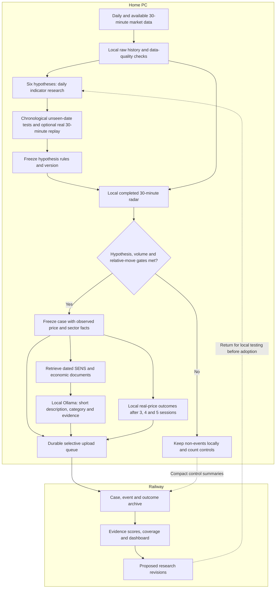

# Six Swing hypotheses — owner proposal, not an installed strategy

Reconciled 5 October 2026. The draft below is retained from the local conceptual discussion. Current implementation is narrower: daily archives and full-history uploads, a separate cloud 1.3.0 comparison lane, and a local weekly-news relationship screen. Local six-family technical backtests, selective 30-minute radar upload, historic SENS retrieval and adaptive event-based entry/exit rules remain proposed. Thresholds are research hypotheses, not validated settings. See [current state](../CURRENT_STATE.md), [target architecture](../architecture/TARGET_ARCHITECTURE.md) and [weekly news](WEEKLY_NEWS_RESEARCH.md).

The six families are selected JSE stock, mining/resources, industrial/global exposure, banks/financials, USD/ZAR and gold. They need separate price/volume/benchmark and event contracts; FX/gold do not inherit a cash-equity volume rule. Freeze these contracts and data admission before the local backtest milestone.

---

# Six Swing hypotheses and local/cloud flow — conceptual draft 0.1

Prepared 5 October 2026. This is a design for refinement, not a code change or a validated trading strategy. All thresholds are initial research candidates. Hold for 3, 4 or 5 trading sessions, with the appropriate instrument calendar. Thirty-minute bars refine a Swing entry; they do not change the intended holding horizon into intraday trading.

## Proposed division of work

Home PC: daily and available 30-minute raw OHLCV; point-in-time instrument/sector memberships; technical calculations; historical scans; chronological backtests; intraday drill-down; event retrieval; local Ollama interpretation; paper outcome calculation; full non-event history; durable upload queue.

Railway: triggered-case archive, short event descriptions and categories, compact control/coverage summaries, later outcome updates, cross-case evidence scores, versioned research proposals and dashboard. Do not automatically change canonical ranking or execution weights. Send proposals back to the local tester and retain adopted research versions separately.

This differs from yesterday's profile 1.3.0: that version uploads daily working histories and evaluates with Ollama Cloud on Railway. It does not already provide this six-hypothesis, local-backtest, 30-minute selective-upload architecture. Keep it intact until the replacement is tested.

## Six testable hypotheses

### H1 — Selected JSE share: individual relative-strength continuation

Select a ticker manually or choose randomly from a dated, data-qualified universe; retain the random seed and include failures. Do not select because its subsequent performance looks good.

Claim: a share in a daily uptrend that breaks or reclaims structure on unusually high real volume and outperforms its own sector has better 3–5-session net outcomes than comparable non-triggered cases.

Entry: test EMA20/50 trend plus a prior-20-session breakout or pullback/reclaim. On available 30-minute data, require a completed-bar confirmation/retest and enter at the next observable price. Volume: compare traded shares with the same half-hour across preceding sessions. Stop: declared structural/ATR protection. Exit: baseline fixed 2R or the chosen 3/4/5-session close; test alternative exits as separate versions.

Context: earnings, trading statements, contracts, capital actions or unexplained company-specific moves. Compare against the sector and a simpler daily-only rule.

### H2 — Mining/resources: commodity-and-currency-supported breakout

Claim: a resource-company breakout supported by the relevant commodity and currency context persists more reliably than an unsupported resource breakout.

Entry: daily trend/structure confirmation, then real relative volume and stock strength beyond its matching resource subsector; refine with a 30-minute retest. Map each company to its relevant commodity and verified exposure rather than using one generic commodity score.

Exit: structural/ATR stop; 2R or 3/4/5-session time exit. Commodity reversal is an experimental invalidation rule, triggered only by information observable then.

Context: commodity supply/demand, production guidance, strikes, outages or policy shocks. Control for commodity and USD/ZAR movement. Gold-miner overlap with H6 must not duplicate portfolio risk.

### H3 — Industrials/global exposure: global-demand or currency-supported continuation

Claim: a company with verified offshore revenue or global demand exposure outperforms local peers for 3–5 sessions when technical strength is supported by its actual external drivers.

Entry: daily breakout or pullback/reclaim, above-normal real volume and relative strength against the appropriate peer basket, followed by completed 30-minute confirmation where available.

Exit: structural/ATR stop; fixed target/time exit. A failed breakout or adverse external-driver reversal can be tested separately.

Context: overseas results, global demand, acquisitions, currency-sensitive guidance or international policy. Exporters, importers and foreign-listed businesses need distinct exposure tags; rand weakness is not automatically favourable to every industrial company.

### H4 — Banks/financials: post-shock recovery with sector confirmation

Claim: after a macro or earnings shock, a financial share that regains a declared technical level with high volume and improving sector strength has a better 3–5-session recovery outcome than an unconfirmed rebound.

Entry: wait for sector stabilisation and a completed-bar reclaim; do not buy solely because the price fell. Test a daily regime filter and a 30-minute reclaim/retest.

Exit: stop below the declared recovery structure with ATR controls; target the prior range level or a separately tested R multiple, with a maximum five-session hold. Renewed breakdown is a predeclared invalidation.

Context: SARB decisions, inflation, credit losses, earnings, capital or sovereign-risk news. Interest-rate changes have mixed effects; learn direction conditionally rather than hard-code rate increases as bullish.

### H5 — USD/ZAR: macro-driven currency impulse

Quote convention: USD/ZAR rising means rand weakening. Claim: a volatility-normalised currency breakout after an identifiable macro surprise continues for 3–5 currency trading sessions more reliably when rate/global-dollar/risk context agrees.

Entry: daily trend/range evidence, then a completed 30-minute breakout or retest. Evaluate both directions analytically; current cash-share paper rules do not provide FX execution capability.

Volume: use verified exchange currency-contract volume where appropriate, or explicitly labelled broker tick activity as a different feature. Spot FX does not have a consolidated traded-share volume measure. If activity data is absent, test a separately versioned price-only branch; never fabricate volume.

Exit: currency ATR/structure stop and declared target/time exit, including spread, financing and event-gap assumptions. Context: SARB/Fed, inflation, employment, sovereign/political shocks or global risk shifts.

### H6 — Gold: price impulse supported by macro context

Assumption for this draft: gold-price exposure, not merely a basket of gold miners. Keep USD gold and ZAR gold distinct; for aligned quotes, ZAR gold depends on both USD gold and USD/ZAR.

Claim: a gold breakout supported by observable dollar/yield/risk context has more persistent 3–5-session outcomes than a technical breakout alone.

Entry: daily trend/structure evidence, then completed 30-minute confirmation/retest where data exists. Volume: actual gold-futures contract volume or a selected listed gold vehicle's traded units can be tested, but these are not global spot-gold volume. Keep instrument and volume venue matched, or label cross-market confirmation explicitly.

Exit: gold-specific ATR/structure stop, R target and 3/4/5-session time exit, with the selected vehicle's real costs/roll/financing assumptions. Context: inflation, monetary policy, real-yield/dollar changes, risk shocks or supply news. Actual trading vehicle remains a design decision, not a broker capability claim.

## Daily research before intraday refinement

1. Verify prices, adjustments, timestamps, actual volume and historical membership. Display estimates must not enter performance validation. Warm-up and affected-window rules are versioned; do not compress missing sessions.
2. Compare a bounded indicator set using daily data: trend/EMA, RSI, ATR, breakout/range, MACD/Bollinger alternatives, real relative volume and sector-relative strength. Test small preregistered combinations rather than search unlimited combinations.
3. Train on older dates, freeze rules, and test on later unseen periods with purging sufficient for the five-session outcomes. Record costs, sample counts, net expectancy, drawdown, turnover, false alerts and stability. Highest historical hit rate alone is not the winner.
4. Drill into candidate historical dates using real 30-minute bars only when available. No daily-close signal can be used to enter earlier that same day. Same-day live refinement uses previous completed daily features and currently completed intraday bars.
5. Separate daily-only results from daily-plus-intraday results. Missing intraday history is a coverage gap, not permission to synthesise bars. Acquire/archive real intraday history prospectively if older dates cannot be obtained.

## Local 30-minute radar

Use completed 30-minute bars, not tick-by-tick data. Keep every observation locally.

Equity relative volume = current completed half-hour's traded shares / mean traded shares for the same half-hour in the preceding 20 valid sessions.

Sector excess return = stock return - its matched sector/peer benchmark return over the same interval and currency. Initially use a simple difference; a trained beta-adjusted version is a separate model.

Research trigger candidate: daily hypothesis eligible AND relative volume at least 1.5 AND absolute sector-excess move at least 1.5 times its prior comparable-slot standard deviation. Test limited alternatives, including 1.2/2.0 volume thresholds, on training data only. A fixed 2% move can create an investigation alert but is not the universal trade criterion. Direction must agree with the particular hypothesis. Do not mix daily ATR and half-hour volatility units.

Time-of-day adjustment matters because openings/closings have different volume patterns. Auctions, gaps and halted securities need explicit session handling. A sector ETF is a labelled proxy, not automatically the actual average of historical sector constituents. Avoid including the selected share in a computed peer average.

## Historical event research and local Ollama

The local retriever searches dated SENS/company releases and official economic sources, initially the event day plus one preceding session. It stores the actual documents, URLs, publication/announcement time, first availability and archive coverage. Ollama interprets retrieved documents through a tool/API boundary; the model does not browse or verify history by itself.

Store a short description such as: 'Trading statement raises earnings guidance before opening.' Retain categories and structured facts separately. Initial category families: EARNINGS, GUIDANCE, CORPORATE_ACTION, OPERATIONS, COMMODITY, MONETARY_POLICY, INFLATION, EMPLOYMENT, CURRENCY_RISK, POLICY_GEOPOLITICS, SECTOR_ROTATION, UNEXPLAINED.

Each event record needs event/hypothesis/version/instrument IDs; decision and document times; source URL/document hash; a 5–15-word description; category/taxonomy version; direct evidence; model confidence; contradictory evidence; price/volume/sector facts; source coverage; and eventual 3/4/5-session results. Distinguish multiple simultaneous events and deduplicate shared market events.

Labels: VERIFIED_BEFORE_ENTRY, POST_MOVE_EXPLANATION, PUBLICATION_TIME_UNKNOWN, or NO_VERIFIED_EVENT_FOUND. 'No event found' does not mean no event occurred. A plausible explanation is an association, not proven causation. Revised economic releases and later articles must not leak into historical entry decisions.

The radar case is frozen and queued immediately; do not wait for a slow Ollama search. Upload event annotations later with the same case ID. Use a durable queue so temporary connectivity loss cannot lose the case.

## Selective Railway evidence

Upload triggered cases with compact preceding-bar/indicator context, source-quality flags, hypothesis version and event annotations. Later upload actual outcomes calculated locally. Periodically upload non-triggered control summaries, exposure counts and missing-data coverage so the denominator remains available. Keep raw non-events locally for reproducible testing.

Railway estimates how particular hypothesis/event/regime combinations behaved and proposes research threshold/evidence-weight changes. Treat correlated stocks reacting to one announcement as a shared episode, not many independent successes. Only a locally validated new research version can use proposed parameters; canonical production weights and live execution remain unchanged.

## Existing modules to reuse and missing links

- Local daily collector and raw snapshot storage already exist; extend retention/provenance and add available 30-minute collection.
- Swing technical snapshots, feature registry and hypothesis evaluator provide the daily baseline; add six explicit hypothesis contracts and richer local evaluation.
- HR11 intraday data/session/as-of/evaluation contracts are reusable; they do not establish real JSE 30-minute history or volume coverage.
- STX40/STXRES/STXIND/STXFIN context exists; peer-sector residuals, exposure mappings and same-slot volume radar need new wiring.
- News/SENS scanner, source registry, document/PDF pipeline, validated fact/analysis boundary and event clustering/persistence are reusable; historical event retrieval and the local-Ollama case classifier are not already completed.
- Authenticated upload, durable persistence and Trading Strategies shell exist; add case/outcome/control-summary contracts and six-hypothesis views.
- Preserve M13 ranking, M14 policy, M15 risk, M16 targets, old strategy versions and paper/demo safety gates. No legacy 60/30/10 or multi-agent trading path reconnection.

## Dashboard concept

Trading Strategies → 3–5 Day Swing Research → six hypothesis cards. Existing JSE cash profiles stay separate from the new typed FX/gold research contracts. Each card shows local-data coverage; daily research score; radar cases; event/category evidence; daily-only versus intraday-refined results; 3/4/5-session outcome tables; rejected cases; sample/coverage/uncertainty and exact versions. Separate states: DETECTED, UNDER_INVESTIGATION, DATA_BLOCKED, SHADOW_ELIGIBLE, VALIDATED_RESEARCH. A case being uploaded never means it is a trading instruction.

## Suggested implementation sequence after concept refinement

A. Freeze six hypothesis contracts, asset/sector mappings, entry/exit labels and shared case schemas.
B. Complete local real-data quality and daily walk-forward research, initially H1 and one sector as a vertical slice.
C. Add verified 30-minute collection, same-slot volume/sector radar and causal intraday drill-down.
D. Add historical SENS/economic retrieval, local Ollama event descriptions and dated event categories.
E. Rewire selective uploads, control summaries, outcome updates and the six-card dashboard.
F. Validate prospective event-conditioned research revisions before adoption. No auto-promotion or LIVE execution.

## Source notes

JSE SENS gateway/EOD products: https://clientportal.jse.co.za/technical-library/sens-project
SENS EOD release-time specification: https://clientportal.jse.co.za/Content/JSE%20User%20Manual%20Items/SENS%20End%20of%20Day%20Market%20Data%20Product%20Specifications.pdf
BIS on the OTC FX market: https://www.bis.org/publications/working-paper-1094-foreign-exchange-market
LBMA daily OTC reporting (T+1, not a 30-minute spot-volume feed): https://www.lbma.org.uk/prices-and-data/lbma-daily-trade-reporting-data

No source entitlement or complete historical archive is assumed. No repository code, deployment, schedule or broker setting changed for this conceptual draft.

## Conceptual flow

